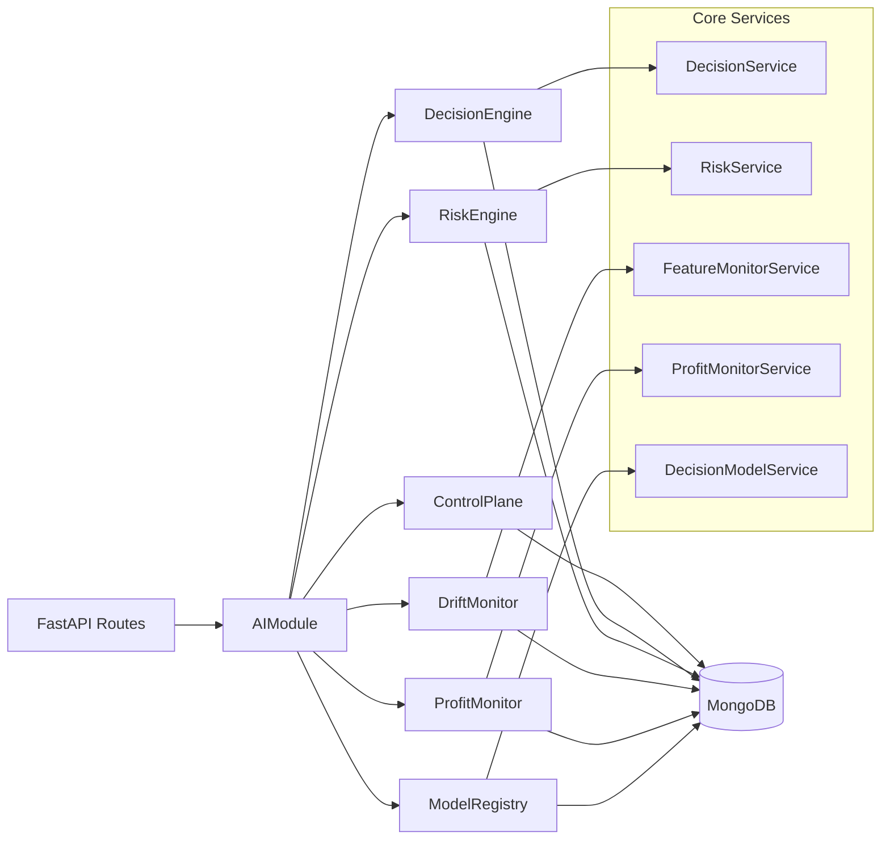

# AI Core Architecture

```mermaid
flowchart LR
    A[FastAPI Routes] --> B[AIModule]
    B --> C[ControlPlane]
    B --> D[DecisionEngine]
    B --> E[RiskEngine]
    B --> F[DriftMonitor]
    B --> G[ProfitMonitor]
    B --> H[ModelRegistry]

    C --> M[(MongoDB)]
    D --> M
    E --> M
    F --> M
    G --> M
    H --> M

    subgraph Core Services
      D1[DecisionService]
      E1[RiskService]
      F1[FeatureMonitorService]
      G1[ProfitMonitorService]
      H1[DecisionModelService]
    end

    D --> D1
    E --> E1
    F --> F1
    G --> G1
    H --> H1
```

