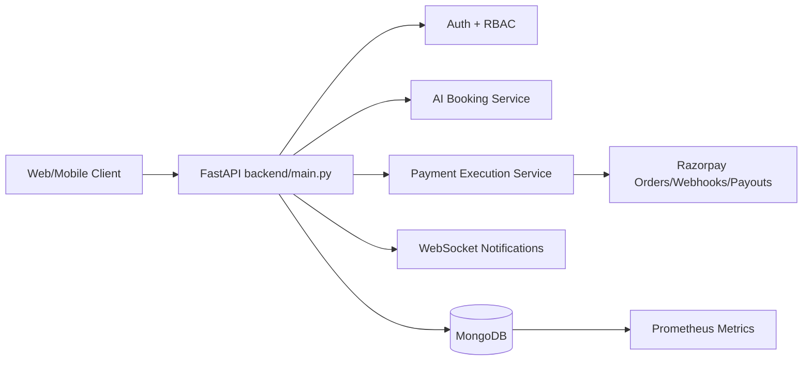
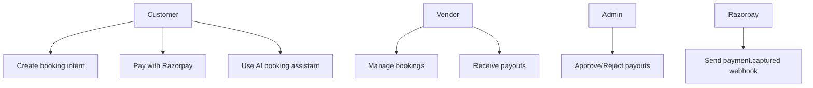
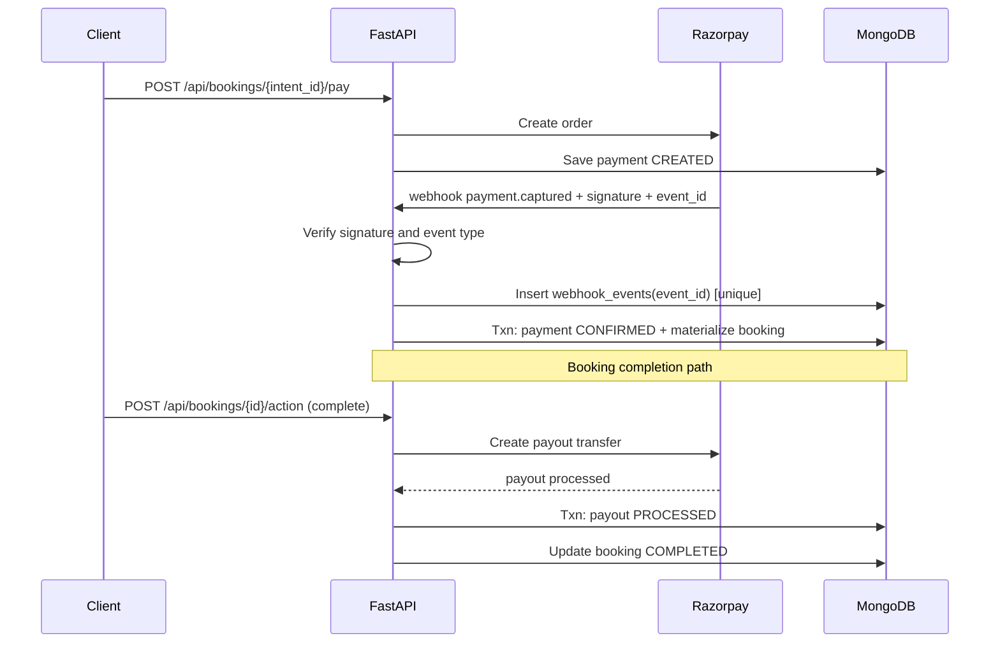
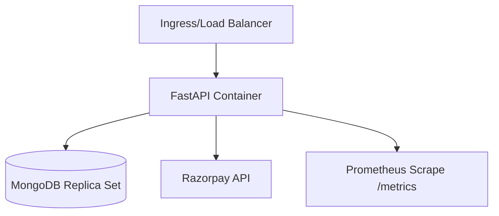

# Backend Technical Documentation

## 1. Refactored Architecture

### Runtime Entrypoint
- Canonical runtime: `backend/main.py`
- Compatibility wrappers (non-initializing): `backend/server.py`, `backend/app/main.py`

### Refactored Backend Structure
```text
backend/
  main.py
  core/
  routers/
  services/
    ai_booking_service.py
  payments/
    execution_service.py
  ai_core/
  models/
  workers/
  docs/
    TECHNICAL_ARCHITECTURE.md
```

### System Architecture Diagram


## 2. Use Case Diagram


## 3. Payment Sequence Diagram


## 4. API Documentation (Core)
- `GET /health`:
  - `status`
  - `timestamp`
  - `database_connection`
- `GET /metrics` (Prometheus format)
- `POST /api/bookings/webhook`:
  - required headers: `x-razorpay-signature`, `x-razorpay-event-id`
  - accepts only `payment.captured`
- `POST /api/bookings/verify`
- `POST /api/admin/payouts/{payout_id}/action`:
  - approve requires `x-idempotency-key`
- `POST /api/assistant/booking/route`

## 5. SDLC Stages Used
1. Discovery and architecture audit
2. Risk modeling (payments, auth, secrets)
3. Incremental refactor and module extraction
4. Defensive coding (idempotency, replay protection, transactions)
5. Observability and operations hardening
6. Deployment artifact update and documentation

## 6. Deployment Architecture


## 7. Environment and Secret Hygiene
- Remove tracked secrets from repository (`backend/.env` removed)
- Keep only templates (`.env.example`)
- Rotate keys:
  - `JWT_SECRET_KEY`
  - `RAZORPAY_KEY_SECRET`
  - `RAZORPAY_WEBHOOK_SECRET`
- Provide runtime secrets via container/runtime secret store.

## 8. Monitoring Signals
- `webhook_events_total{event,outcome}`
- `payment_processing_latency_seconds{flow}`
- `auth_failures_total{reason,endpoint}`
